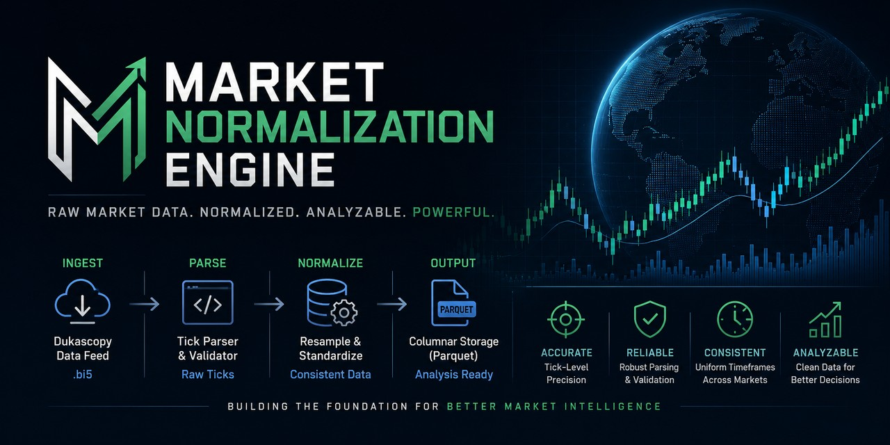

# MarketNormalizationEngine




###Author Note 

Please star this repository if you find it useful! It means alot to me.  
Email marlon.dominguez307@gmail.com for any implementation requests, contribution requests, or bug requests.  

### Overview

A high-performance, parallelized market data ingestion and normalization engine designed to download, parse, organize, and resample raw Dukascopy forex tick data into a clean ML-ready format.

This project focuses on data normalization infrastructure, not trading logic.

## Dukascopy (Forex Data)

### Features

* Parallelized hourly tick downloads
* Automatic retry queue with exponential backoff
* Corrupted/empty response detection
* Structured parquet-based storage
* BI5 → Parquet normalization pipeline
* Multithreaded parsing and resampling
* ML-ready dataframe generation
* CLI and code-driven execution
* Hierarchical dataset organization
* Timeframe aggregation using Pandas resampling
* Detailed logging and ingestion diagnostics

### Architecture

The system is designed around a clean separation of concerns:

- Downloader → fetch raw `.bi5` tick data
- Storage Layer → organize files by symbol/date/hour
- Parser → decode bid/ask/mid and normalie
- Resampler → Produce dataframe with requested timeframe

Completely ready for feature Extraction / ML! 

#### Components

##### Downloader

Fetches raw .bi5 tick data directly from Dukascopy servers.

##### Parser

Decodes compressed binary tick data into normalized parquet datasets.

##### Storage Layer

Organizes data hierarchically by:

```bash
symbol/date/hour
```

##### Resampler

Aggregates tick data into configurable timeframes such as:

```bash
1min
5min
15min
1h
4h
1d
```

### Storage Structure 

#### Raw BI5 Data

```bash
raw_data/
    EURUSD/
        2024-01-02/
            EURUSD_20240102_00h.bi5
            EURUSD_20240102_01h.bi5
```

#### Parsed Parquet Data

```bash
parsed_data/
    EURUSD/
        2024-01-02/
            EURUSD_20240102_00h.parquet
            EURUSD_20240102_01h.parquet
```

#### Resampled Data

```bash
resampled_data/
    EURUSD/
        1min/
            20240102.parquet

        5min/
            20240102.parquet

        1h/
            20240102.parquet
```

### CLI Usage

By default, the engine performs download and parse operations automatically.
In other words, if a specific operation is not specified then the downloader and parser are both performed.

#### Single Day Download

```bash
python dukascopy_data_engine.py --symbol EURUSD --start-date 2024-01-02
```

#### Range Download

```bash
python dukascopy_data_engine.py --symbol EURUSD --start-date 2024-01-01 --end-date 2024-01-10
```

#### Custom Output Directories

```bash
python dukascopy_data_engine.py 

--symbol EURUSD 

--start-date 2024-01-02 

--raw-data-dir custom_raw_data 

--parsed-data-dir custom_parsed_data
```

#### Resampling Through CLI 

```bash
python dukascopy_data_engine.py --operation resample --symbol EURUSD --parsed-data-dir parsed_data --timeframe 1min
```

### Code Usage

The engine can also be used programmatically. 

#### Imports

```bash
from dukascopy_data_downloader import begin_downloader_process
from dukascopy_bi5_data_parser import begin_parser_process
import resampler
```

#### Using the Downloader 

##### Function

```bash
begin_downloader_process(
    symbol,
    start_date,
    end_date=None,
    location="raw_data"
)
```

##### Example

```bash
from dukascopy_data_downloader import begin_downloader_process

begin_downloader_process(
    symbol="EURUSD",
    start_date="2024-01-02",
    end_date=None,
    location="raw_data"
)
```

#### Using the Parser

##### Example

```bash
from dukascopy_bi5_data_parser import begin_parser_process

begin_parser_process(
    "raw_data",
    "parsed_data"
)
```

#### Using the Resampler 

##### Example

```bash
import resampler

results = resampler.invoke_resampler(
    parquet_dir="parsed_data",
    symbol="EURUSD",
    timeframe="1d"
)
```

The resampler returns: 

```bash
dict[date] -> pandas.DataFrame
```

where each dataframe contains normalized OHLCV-style bars. 

##### Example Columns

```bash
timestamp
open
high
low
close
bid_volume
ask_volume
```
#### Supported Resampler Timeframes

The resampler currently supports:

```bash
1s
5s
15s
30s

1min
5min
15min
30min

1h
4h

1d
1w
```

### License

This project is licensed under the Apache 2.0 License.


